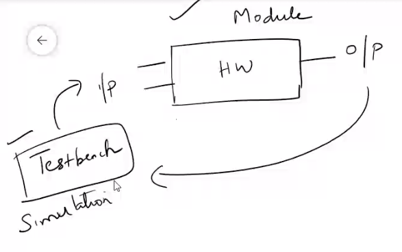

# Lab Sheet 1

## LearningObjectives

- Getting started with HDL program using Icarus Simulator
- Understand basic Verilog language primitives (e.g. module, datatypes, identifiers, vectors, registers, keywords etc. )
- To understand the various types of modeling

## Verilog

- a Hardware Description Language (HDL)
- Didgital designer uses it to describe designs at a higher level of abstractions - architectural, behavioral and lower levels - gate and switch levels and simulate them b4 commiting to fabrication
- at a point of time, multiple modules could be running, we are simulating hardware

## Modules

- components are designed inside module
- structural and behavioral statements
- module name is optional in syntax for primitives (and/or/not), but for user-defined modules, it is necessary
- timescale is a directive used to define unit and precision of time measurement
  - like 15cm scale me 1cm = unit, 1mm = precision

## Level of abstractions

- Gate level modeling
  - close to actual circuit
  - define things in terms of gates
- Data Flow
  - acc to how data flows between registers and how a design processes data rather than instantiation of gates
  - expressions and operators
- Behavioral
  - highest level of abstraction
  - algo type

## Simulation

- testing the design
- in gen, input becomes reg, and output becomes wire

## Exercises

- [BCD to gray code](bcd2gray.v)
- [magnitude comparator](magcomp.v)
- [1-bit adder](fadder_1bit.v), [testbench](tb_fadder_1bit.v)
- [4-bit adder](fadder_4bit.v), [testbench](tb_fadder_4bit.v)
- [addsub](addSub_4bit.v), [testbench](tb_addSub_4bit.v)
